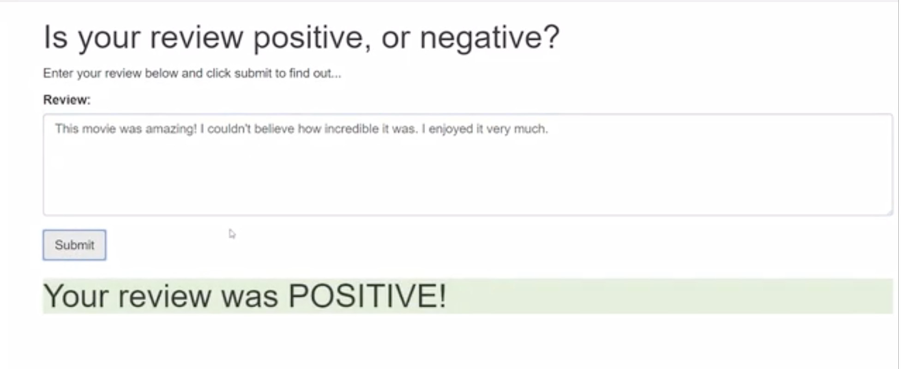
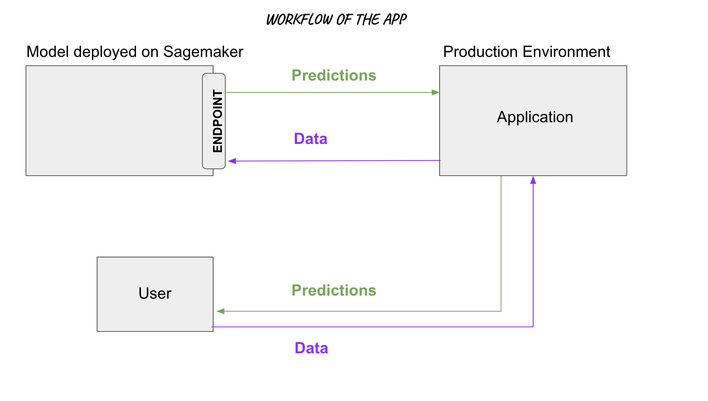
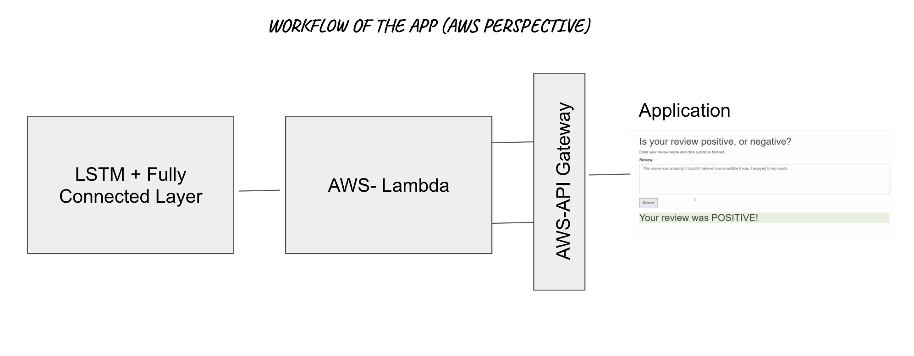

# Sentiment Analysis Project, Machine Learning Deployment

The project creates a web tool where the user enters a movie review and the web interface returns the sentiment (positive/negative) of that review. This project is part of Udacity's Machine Learning Engineering Nanodegree program. 
This is how the tool looks like (basic version). The focus of the project is not the front end designing, but to understand the entire machine learning workflow on AWS.  

## Background

The project is based on the workflow where user sends the input via application which in turn invokes the endpoint to use the model.  

In terms of AWS, we invoke the endpoint via AWS-API Gateway and AWS-Lambda function as shown below:  

## Model used
Pytorch's LSTM + Fully Connected End Layer

## Evaluation and Results
Accuracy score of 85.4% (This has a lot of scope for improvement where we can further experiment with the model architecture or with the tuning of the hyperparameters.)

## Getting Started
Run the file SagemakerProject.ipynb.  Execute all the cells in order to get access to the data. At the end of the notebook, the instructions are given how to setup AWS-Lambda and AWS-API Gateway via IAM Roles.

## Author
* **Rupali Sinha** - *Initial work*
